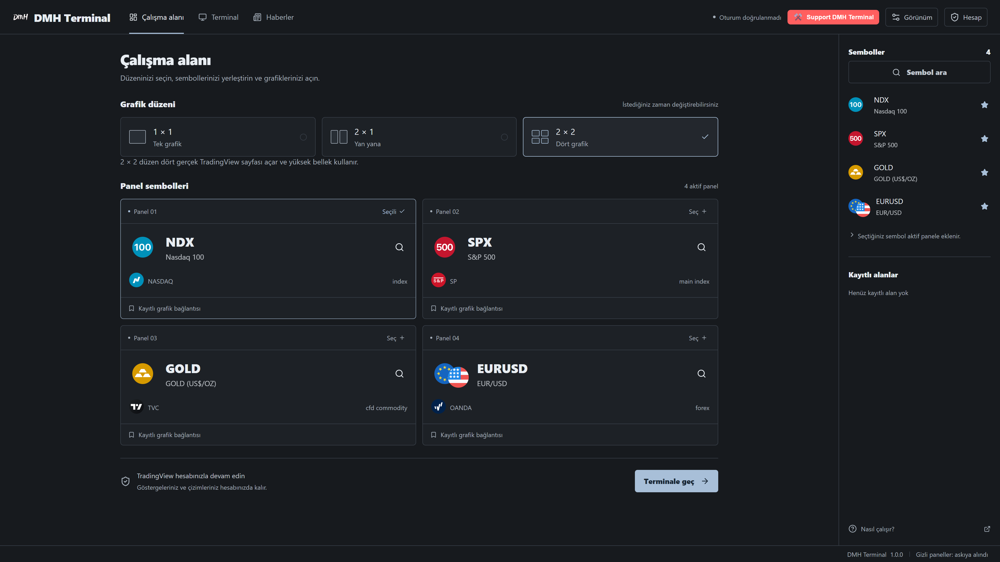
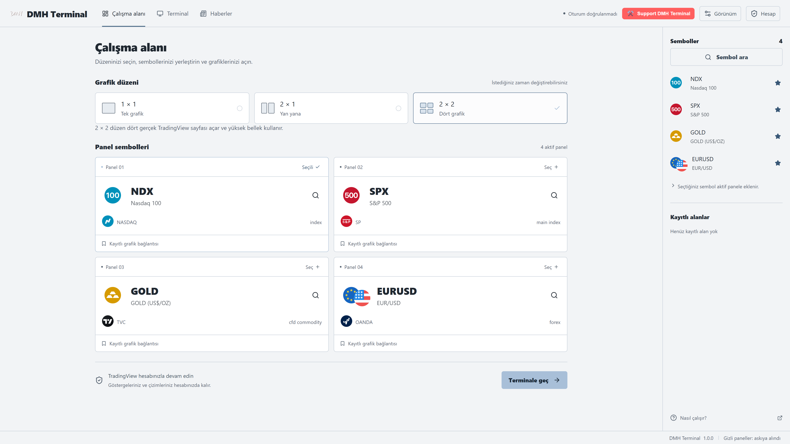
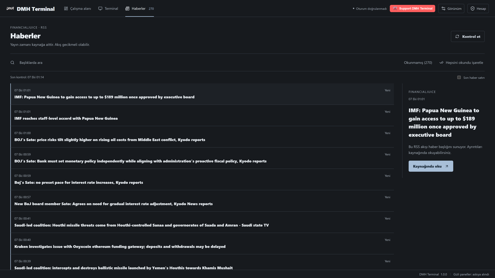
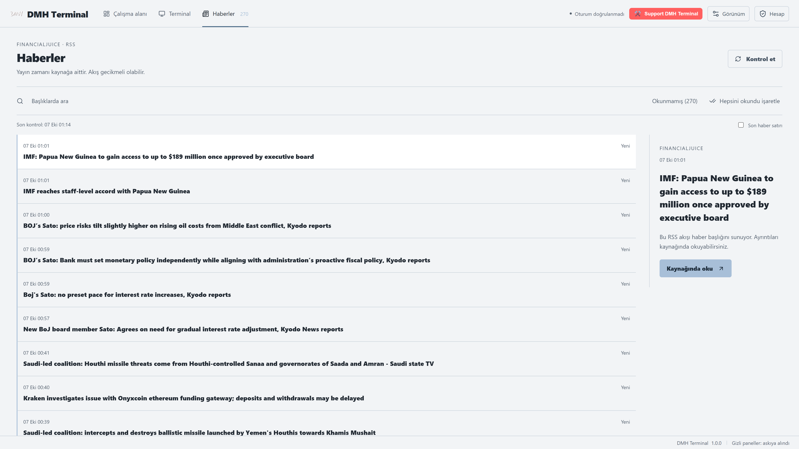

  

<h1 align="center">DMH Terminal</h1>

  T-View grafiklerini tek pencerede toplayan akıllı masaüstü uygulaması.

  
  

 
 

## Özellikler

- 1×1, 2×1, 2×2 düzende gerçek T-View grafikleri; tek oturum
- Çevrimdışı sembol kataloğu, kategori filtresi, favoriler
- Piyasa haber akışı
- Uygulama içi güncelleme

## Platform

- Windows x64 — [son sürümü indir](https://github.com/dumbmoneyhub/DMH-Terminal/releases/download/v1.0.0/DMH.Terminal_1.0.0_x64-setup.exe)

## Notlar

- Ücretsiz T-View hesap limitleri geçerlidir.
- Parola tutulmaz; ayarlar ve oturum yerelde saklanır.